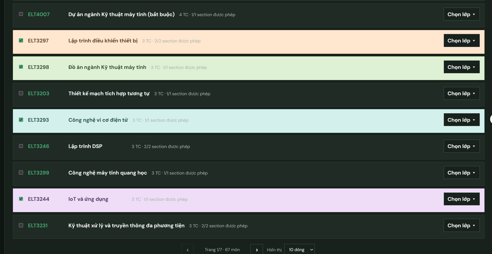
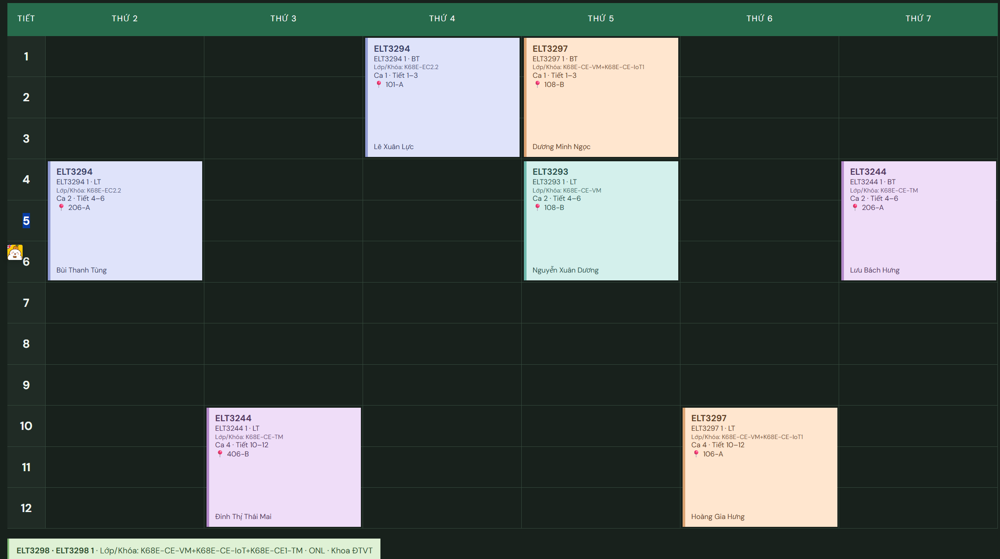

# Dùng TKB Universal trong 1 phút

> File Excel được xử lý ngay trên trình duyệt. Dữ liệu của bạn không được gửi lên máy chủ.

## 1. Nạp và kiểm tra dữ liệu

1. Bấm **Chọn file Excel** và chọn đúng sheet lịch học.
2. Kiểm tra các cột đã matching, đặc biệt là **Mã HP**, **Mã LHP**, **Thứ**, **Ca/Tiết**, **Khối lượng HUST**, **Nhóm**, **Giảng viên**.
3. Nếu file không có Kỳ học, nhập kỳ vào ô được báo màu vàng.
4. Xem bảng dữ liệu sau matching rồi bấm **Xác nhận và cập nhật CSDL**.

## 2. Chọn môn và lớp có thể học

- Tick môn muốn đăng ký.
- Bấm **Chọn lớp** rồi giữ lại các lớp/nhóm bạn có thể học.
- `CL` là cả lớp; `N1`, `N2`, `N3` là các nhóm BT/TH/TN thay thế nhau.
- Bỏ chọn hết lớp sẽ chỉ **tạm ngừng xếp môn**, không xóa môn khỏi danh sách.
- Có thể gõ không dấu, ví dụ `ky thuat`, và tìm bằng cả tên tiếng Anh.

## 3. Lọc và tạo thời khóa biểu

1. Chọn ngày nghỉ, ca nghỉ hoặc chỉ học sáng/chiều/tối nếu cần.
2. Bấm **Tính tối đa 200 lịch MIX**.
3. Dùng nút `‹ ›` để duyệt các phương án.
4. Kéo **Độ cao tiết** để thu gọn hoặc mở rộng bảng 14 tiết.
5. Kéo chuột trên chữ trong ô lịch để copy; bấm **In / Lưu PDF** để xuất PDF dạng chữ.

## Dữ liệu HUST V2.5

- `2(2-1-0-4)` trong **Khối_lượng** được hiểu là `2` tín chỉ.
- Kíp Sáng dùng tiết 1–6, Kíp Chiều dùng tiết 7–12, Kíp Tối dùng tiết 13–14.
- Giờ `0700–0900` chiếm toàn bộ các tiết có giao với khoảng giờ và được hiện rõ `07:00–09:00` trên thẻ lịch.

## Cần hướng dẫn chi tiết?

Mở **README.md** trong repository GitHub để xem đầy đủ cách matching UET/HUST, xử lý Ca/Tiết/Kíp/Tuần học, chạy bằng VS Code và cập nhật GitHub Pages.

---

### Cách sửa trang hướng dẫn này

Sửa file `public/HUONG_DAN.md`. Muốn thay ảnh, chép ảnh PNG/JPG vào `public/guide-images/` rồi chèn:

``

